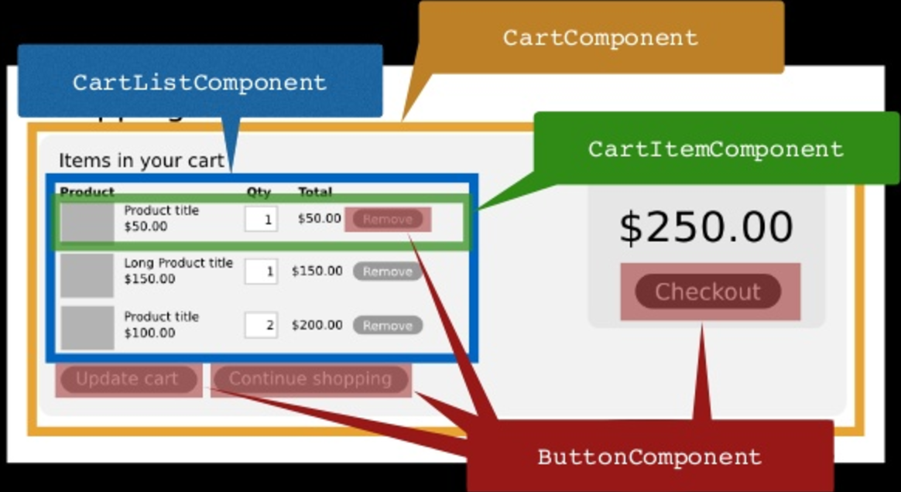

title: React
author:
  name: Thanks!
  url: https://sshumway.github.io/uppervalleyjs-react/
output: index.html
controls: true
style: style.css
theme: jdan/cleaver-retro

--

# ReactJS
## UI Made Easy


--

### Some background

A JavaScript library for building user interfaces


Developed by acebook


Open sourced in March 2015

--

### Since then...

Embraced by the community


So many stars:


So many packages: 


--

### And lots of companies

* Facebook (obviously)
* Microsoft
* Airbnb
* Apple
* The New York Times
* You get the idea

--

### Ok, so what does it do?

<p></p>
## The **V** in **MV\***

* Separation of components instead of separation of concerns
* Super fast DOM updates
* Synthetic event system
* One-way data binding

--

### That sounds great, how does it do it?

* Components tell react what you want to render
* React renders them and updates them when state changes

--

### JSX

Syntax extension to JavaScript

```javascript
const element = </img>;

function getGreeting(user) {
  if (user) {
    return <h1>Hello, {formatName(user)}!</h1>;
  }
  return <h1>Hello, Stranger.</h1>;
}
```

--

### JSX

Compiles to JavaScript

```javascript
const element = (
  <h1 className="greeting">
    Hello, world!
  </h1>
);

const element = React.createElement(
  'h1',
  {className: 'greeting'},
  'Hello, world!'
);
```

--

### JSX

Turns into

```javascript
const element = {
  type: 'h1',
  props: {
    className: 'greeting',
    children: 'Hello, world'
  }
};
```

--

### Virtual DOM


* Batch updates
* Diff changes to minimize DOM updates

--

### Neat, so how do I do it?

1. Create components
2. Compose components
3. Enjoy your declarative, testable, understandable UI

--

### What are components?

* Building blocks of the UI
* The nodes of the virtual DOM

<p style="text-align: center;">

</p>

--

### A simple component

```javascript
class Welcome extends React.Component {
  render() {
    return <h1>Hello, {this.props.name}</h1>;
  }
}
```

used like so:

```javascript
const element = <Welcome name="Meghan" />;
```

throw it on the page with

```javascript
ReactDOM.render(
  element,
  document.getElementById('root')
);
```

--

### Props

* Arbitrary inputs to component
* Passed into user-defined component as an object "props"
* Read-Only - a component must never modify its own props
* A components configuration

[Example](http://www.react.run/BymsYLHLb/8)

--

### State

* Private to the component
* Controlled by the component
* Mutates in time (mostly from user events)
* Change it with `setState`

--

### Using State

[Example](http://www.react.run/BymsYLHLb/6)

--

### Using State

[A better example](http://www.react.run/BymsYLHLb/5)

--

### Functional, Stateless Components

Props in, rendered UI out

```javascript
const Username = ({ username }) =>
  <p>
    The logged in user is: {username}
  </p>;
```

--

### Composing Components

<p style="text-align: center;">

</p>

--

### Composing Components

```javascript
<CartComponent>
  <CartListComponent>
    <CartItemComponent>
      <ProductComponent />
      <ButtonComponent />
    </CartItemComponent>
  </CartListComponent>
  <CartTotalComponent>
    <PriceComponent />
    <ButtonComponent />
  </CartTotalComponent>
</CartComponent>
```

--

# [Demo time!](https://uppervalleyjs-react-demo-app.firebaseapp.com/)


## I sure hope this works...

## [Source](https://github.com/sshumway/uppervalleyjs-react/tree/master)

--

### What about the data?

React doesn't care


Flux: pattern developed by Facebook
* Your model is always the source of truth

--

### What is Flux?

1. Your view triggers an event
2. That event updates a model
3. The model triggers an event
4. The view responds to the model's event by re-rendering

--

### What else is there

* Redux
  - a popular flux implementation
  - single store
* Mobx
 - make variables @observable

--

### Testing made easy

Deterministic UI


* Jest: snapshot testing
* Enzyme: DOM testing

--

### An Enzyme Test

```javascript
test('CheckboxWithLabel changes the text after click', () => {
  // Render a checkbox with label in the document
  const checkbox = shallow(
    <CheckboxWithLabel labelOn="On" labelOff="Off" />
  );

  expect(checkbox.text()).toEqual('Off');

  checkbox.find('input').simulate('change');

  expect(checkbox.text()).toEqual('On');
});
```

--

### Dev Tools

[React dev tools](https://github.com/facebook/react-devtools)


--

### Dev Tools

Bootstrapping development

NodeJS, npm/yarn, babel, webpack

[Create React App](https://github.com/facebookincubator/create-react-app)

[React Slingshot](https://github.com/coryhouse/react-slingshot)

--

### Beyond the page
* React Server
  - Render pages on the server

* React Native
  * App written in JS using React
  * Translated to native controls

--

### What's the gotcha?

* Library size
* Facebook patent clawback clause
